# Design diff — current app vs. Claude Design "Bible Read" prototype

_Generated 2026-06-24. Current-app screenshots captured live on a physical Pixel 6 Pro under the
real `AppTheme` light scheme (`designLightScheme`) with seeded fake data; prototype renders are from
the Claude Design handoff bundle (`~/Downloads/Bible Read-handoff.zip`)._

> **Implementation status (updated 2026-06-24):** Items #1b (read-state medallion + "Tap to undo",
> snackbar removed), #2 (Community → "Circle": reading hero + read-with-community CTA + "Your reading
> groups"; **Friends Activity removed**), #3 (Journey → "Path": hero + Shown-up/Day-streak stat tiles +
> "Showing up" grid; Bible Library + embedded Schedule removed — note: the app has no reflections
> feature, so the prototype's "Reflections" tile/thread were substituted with a Day-streak tile and
> omitted), #7 (avatar → initial-on-lavender), #8 (dark-mode card borders strengthened), and the
> "Details"→"Manage" / "Consistency"→"Showing up" copy have been implemented. Verify visually on device.

## TL;DR

The prototype's **design system is already fully implemented** — [lib/theme/app_theme.dart](../lib/theme/app_theme.dart)
matches `app/theme.jsx` token-for-token (warm-paper/aubergine palette, `#6A53AD` lavender, Spectral +
Hanken Grotesk, 22px cards / 16px buttons / 52px button height). The **Today / Home** screen is
essentially design-complete. The remaining gaps are **information-architecture differences on
Community and Journey**, where the prototype reframes both screens around the daily scripture reading.

| # | Screen | State of alignment | Biggest gap | Priority |
|---|--------|--------------------|-------------|----------|
| 1 | Today / Home (unread) | ✅ Very close | Avatar fallback (blue glyph vs. lavender initial); verify community/consistency glimpses | Low–Med |
| 1b | Today **read / "checked" state** | ⚠️ Off | Outline-ring check + rectangular "Undo" button + snackbar; prototype = **filled lavender medallion** (concentric rings, glow) on a **lavender-gradient** card + compact "× Tap to undo" pill, no snackbar | **High** |
| 2 | Community ("Circle") | ⚠️ Different IA | App = "Group Progress" + "Friends Activity"; prototype leads with a "The community's reading" scripture hero + read-with-community CTA + "Your reading groups" | **High** |
| 3 | Journey ("Path") | ⚠️ Different IA | App = personal-journey card + Bible Library + Consistency + Schedule; prototype = journey hero + 2 stat tiles (Shown up / Reflections) + "Showing up" grid + reflections thread | **High** |
| 4 | Reading schedule | ✅ Close | Copy + entry point ("2 readings to revisit" vs. "Catch up at your own pace…"); dedicated screen vs. embedded | Low–Med |
| 5 | Challenges | ➖ In-theme, empty | No active season seeded — could not deep-compare | Verify |
| 6 | Settings | ➖ Not captured | Recently redesigned (#739) — assume aligned, spot-check | Verify |
| 7 | Avatar (global) | ⚠️ Off-palette | Default avatar = Material person glyph on pale-blue circle across all tabs; prototype = initial on lavender (`--primary-soft`) | Med |
| 8 | **Dark mode** | ⚠️ Needs polish | Palette + primary button correct, but weak surface-to-background separation and low-contrast secondary/ghost buttons ("Mark as read") | **Med** |

> **Capture note:** Community and Journey gate their top cards on a `Future.wait([...])` /
> `_isLoading` flag ([journey_page.dart:57](../lib/pages/journey_page.dart)) that the in-memory
> `FakeFirebaseFirestore` never resolves (e.g. `getActivePlans().first` never emits), so those hero
> cards render as skeletons in the harness. The structural comparison below relies on the visible
> section headers + the prototype JSX source; an empty-but-loaded Community (run 1) confirmed the
> "Group Progress / Friends Activity" structure.

---

## 1. Today / Home — ✅ very close

| Current | Prototype |
|---|---|
|  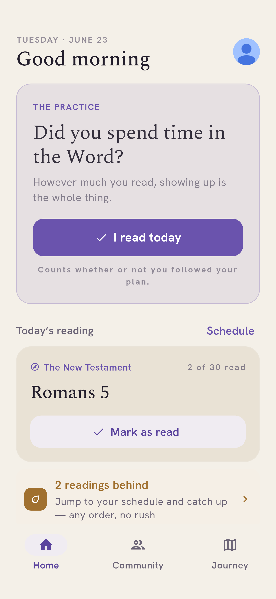 | 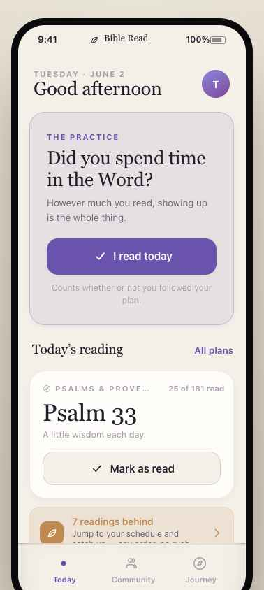 |

**Matches:** eyebrow date + greeting ("Good morning/afternoon/evening"), the "THE PRACTICE / Did you
spend time in the Word? / However much you read, showing up is the whole thing." habit block, the
full-width primary "I read today" button, the "Counts whether or not you followed your plan" caption,
the "Today's reading" section with action link, the reading hero card (compass eyebrow + plan name +
"X of Y read", big serif reference, ghost "Mark as read"), the "N readings behind / Jump to your
schedule and catch up — any order, no rush" catch-up row, and "+ Start a new plan". Typography,
spacing, colors all on-spec.

**Deltas:**
- **Avatar fallback (Med).** Current shows a generic person glyph on a pale-blue circle; prototype
  shows the user's initial on a lavender (`--primary-soft`) circle. (Partly a seed artifact — the fake
  `photoUrl` fails to load — but the fallback styling itself is off-palette.) See global item #7.
- **Verify (Low).** The prototype's Today screen also includes a "Your community" presence glimpse and
  a consistency glimpse card lower down; these are conditional (`showGlimpse`, post-read reflection)
  and were not visible in the captured (un-read) state. Confirm they exist and match.

---

## 1b. Today — read / "checked" state — ⚠️ off (High)

After the daily habit is marked, the habit block transforms. The copy ("Thank you for being here")
and placement match, but the treatment is noticeably plainer than the prototype's affirmation.

| Current (read state) | Prototype (`affirm.png`) |
|---|---|
| 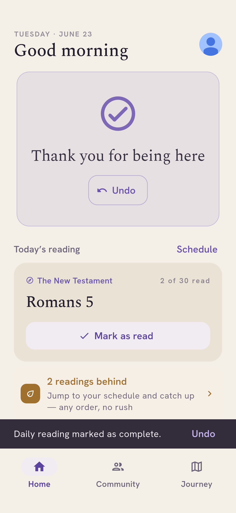 | 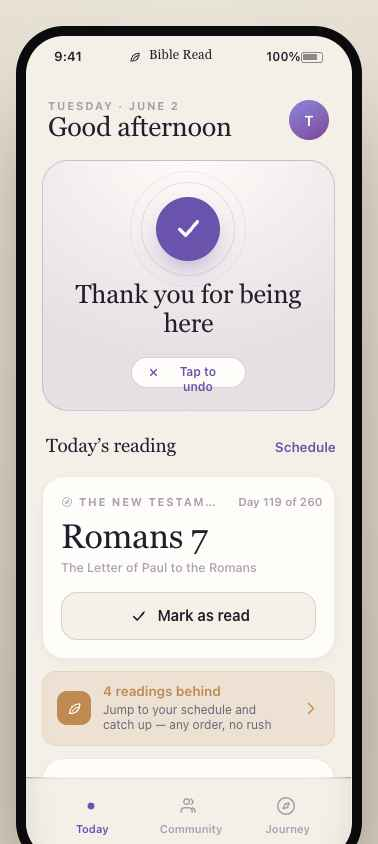 |

**Deltas:**
- **Check mark (High).** Current uses a thin **outline ring** with a check. Prototype uses a **solid
  filled lavender medallion** (64px `--primary` circle, white check) wrapped in **two concentric rings**
  with a soft glow/shadow — a deliberate "small reward".
- **Card background (Med).** Current card reads flat/grey. Prototype uses a warm **radial gradient**
  (`--surface` → `--primary-soft`) inside a `--primary-line` border, so the affirmation glows.
- **Undo affordance (Med).** Current shows a rectangular **"↩ Undo" button *and* a bottom snackbar**
  ("Daily reading marked as complete"). Prototype has a single compact **"× Tap to undo"** pill inside
  the card and **no snackbar**. (Undo itself matches intent — it was added in #742 — just restyle it
  and drop the redundant snackbar.)

---

## 2. Community / "Circle" — ⚠️ different information architecture (High)

| Current | Prototype |
|---|---|
| 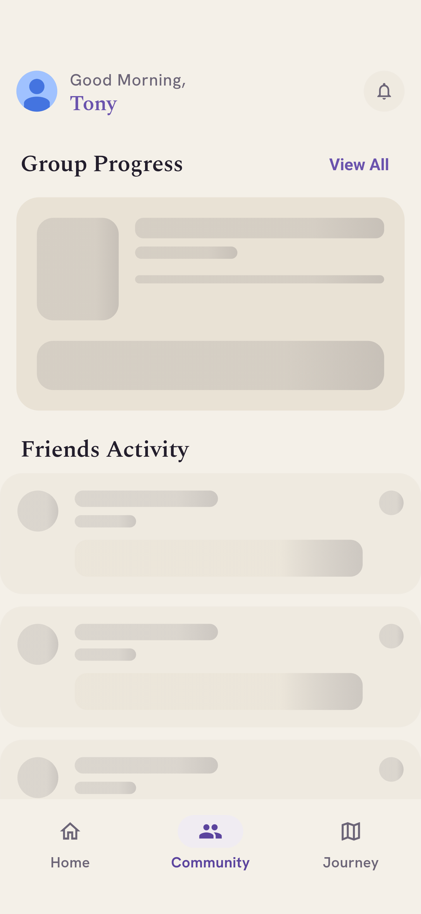 _(top card shimmering — loader didn't resolve in harness; run 1 showed it loaded-empty as "Group Progress: No active groups" + "Friends Activity: No recent activity")_ | 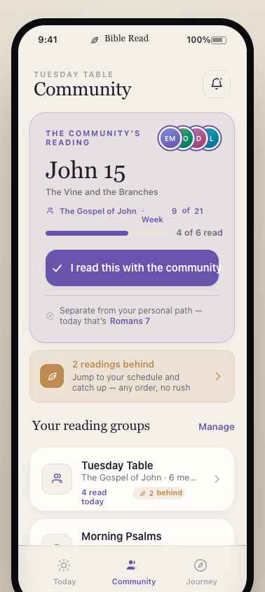 |

**Current structure:** avatar + "Good Morning, Tony" header → **"Group Progress"** card (+ "View All")
→ **"Friends Activity"** feed list.

**Prototype structure (`circle.jsx`):** eyebrow = group name + serif title **"Community"** + bell →
big primary-soft **"THE COMMUNITY'S READING"** hero (presence stack, big serif passage e.g. "John 15 /
The Vine and the Branches", "The Gospel of John · Week 9 of 21", progress meter "4 of 6 read", primary
**"I read this with the community"**, divider note "Separate from your personal path — today that's
Romans 7") → catch-up row → **"Your reading groups"** (+ "Manage") list of group cards (icon, name,
plan · members, "N read today", behind badge).

**Deltas:**
- **Hero (High).** Prototype centers Community on a shared-reading scripture hero with a "read with the
  community" CTA + presence + week/progress. Current has no equivalent — it leads with a generic
  "Group Progress" summary widget.
- **Header (Med).** Current = avatar + "Good Morning, {name}"; prototype = group-name eyebrow + serif
  "Community" title + notification bell.
- **"Your reading groups" list (Med).** Prototype shows per-group cards with plan/members/"read today"/
  behind badge; current's "Group Progress" + "View All" is a different model.
- **"Friends Activity" feed (Med).** Has no direct counterpart in the prototype Circle (friends fold
  into presence + shared reflections). Decide whether to keep, relocate, or drop.

---

## 3. Journey / "Path" — ⚠️ different information architecture (High)

| Current (top, then scrolled to Schedule) | Prototype |
|---|---|
| 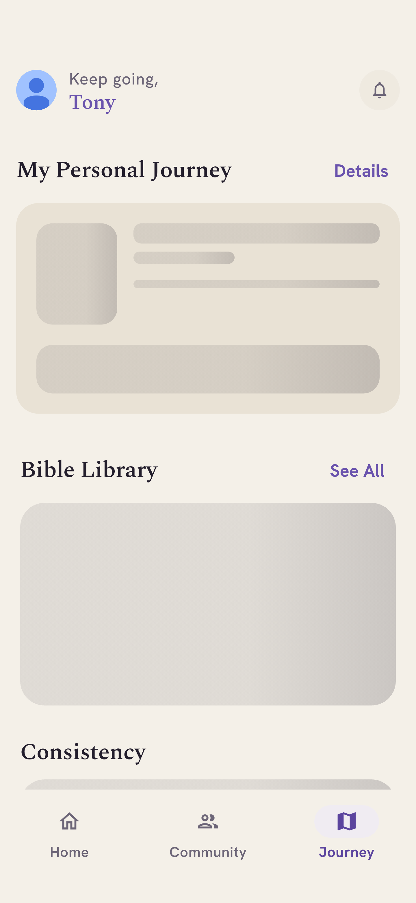 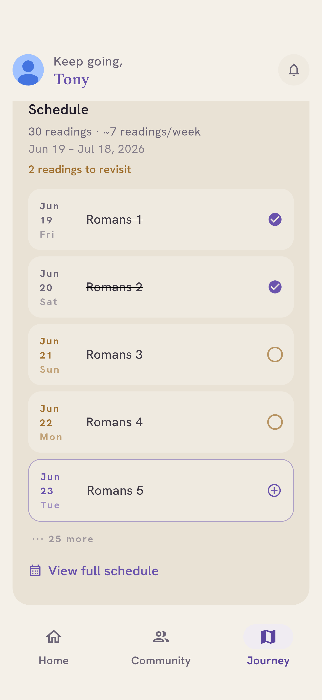 _(top card shimmering — loader didn't resolve in harness)_ | 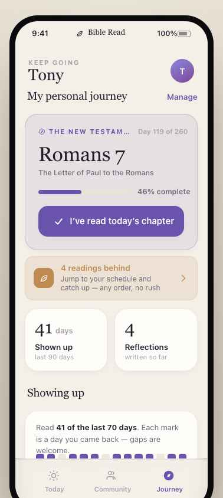 |

**Current structure:** avatar + "Keep going, Tony" → **"My Personal Journey"** card (+ "Details") →
**"Bible Library"** grid (+ "See All") → **"Consistency"** → **"Schedule"** list (30 readings · ~7/week,
dated rows with check/circle/add toggles, "View full schedule").

**Prototype structure (`path.jsx`):** eyebrow "KEEP GOING" + serif name "Tony" → "My personal journey"
(+ "Manage") → primary-soft hero (plan title + "Day 119 of 260", big serif "Romans 7", progress meter
"46% complete", primary **"I've read today's chapter"**) → catch-up row → two **stat tiles** ("41 days
/ Shown up / last 90 days" and "4 / Reflections / written so far") → **"Showing up"** consistency grid
("Read 41 of the last 70 days… gaps are welcome") → reflections thread.

**Deltas:**
- **Section composition (High).** Current Journey is a catch-all (journey card + **Bible Library** +
  Consistency + **Schedule**). The prototype Path screen has **no** Bible Library or full Schedule list
  — it's journey hero + stat tiles + consistency + reflections. Library and schedule live elsewhere
  (library tab / `openSchedule` sheet).
- **Missing stat tiles & reflections thread (High/Med).** Prototype's "Shown up / Reflections" tiles
  and the reflections list weren't present in the current capture.
- **Labels (Med).** Action link "Details" vs. prototype "Manage"; section "Consistency" vs. prototype
  "Showing up". Header is avatar + sans "Keep going, Tony" vs. eyebrow "KEEP GOING" + serif name.

---

## 4. Reading schedule — ✅ close

| Current (Journey › Schedule) | Prototype |
|---|---|
|  | 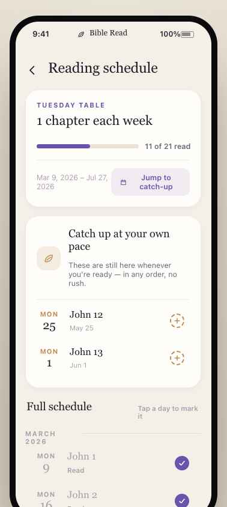 |

**Matches:** dated reading rows with serif references, per-day check / open-circle / add (⊕) toggles,
month/progress framing, warm theme, "View full schedule". Closely follows the prototype's `sch-toggle`
list pattern.

**Deltas:**
- **Copy (Low–Med).** Current "2 readings to revisit" vs. prototype "Catch up at your own pace — these
  are still here whenever you're ready, in any order, no rush." Prototype also splits "Catch up at your
  own pace" (missed) from "Full schedule".
- **Entry point (Low).** Prototype has a dedicated "Reading schedule" screen header; current shows the
  list inline in Journey (a dedicated full-schedule page exists behind "View full schedule" — confirm
  it matches the prototype header/layout).

---

## 8. Dark mode — ⚠️ needs polish (Med)

_(No dark prototype render exists in the bundle, so this compares against the dark tokens in
`app/theme.jsx` / `AppTheme.designDarkScheme`.)_

| Dark Home (top) | Dark Home (scrolled) | Dark Journey |
|---|---|---|
| 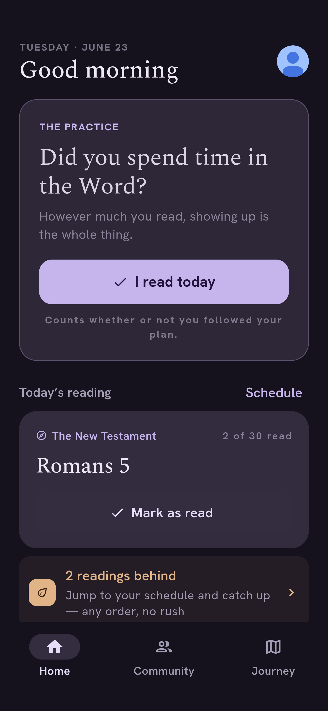 | 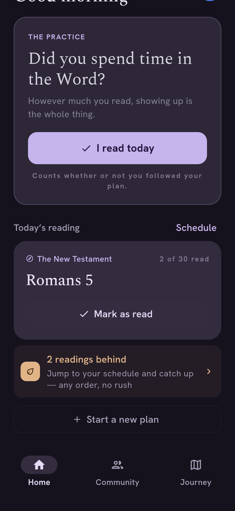 | 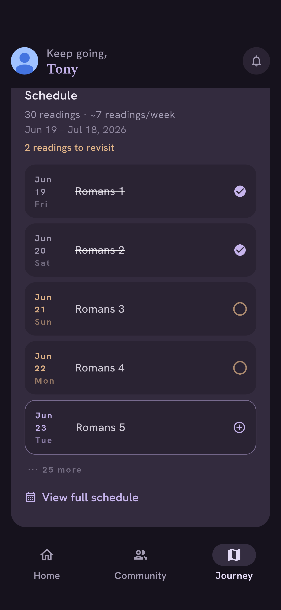 |

**Correct:** deep-aubergine background, lavender accents, and the **primary "I read today" button**
renders on-spec — lavender `#C6B4EC` fill with dark `#22153D` text/check. Good contrast.

**Deltas (the "overlays / contrast against background" concern):**
- **Weak surface-to-background separation (Med).** In dark, cards sit very close in luminance to the
  page background and lean almost entirely on a hairline border to read as cards — the elevation
  hierarchy is much softer than in light mode. The "THE PRACTICE" card in particular barely lifts off
  the background. Consider stepping card surfaces up toward `--surface` `#1E1926` / `--surface-2`
  `#272030` (the prototype's intended card vs. bg step) and/or strengthening borders in dark.
- **Low-contrast secondary / ghost buttons (Med).** The reading card's **"Mark as read"** ghost button
  has little separation from its container in dark — the pill nearly merges with the card surface.
  Prototype `btn-ghost` = `--surface-2` on a `--surface` card, a clear step; ensure the dark ghost
  button uses a surface that contrasts with the card it sits on.
- **Reading hero uses `colorScheme.surfaceContainer`** ([todays_reading_card.dart:77](../lib/widgets/todays_reading_card.dart)),
  which is fine in light (warm cream) but worth checking the dark value reads as intended next to the
  cooler practice card.

> Note: commit #743 already aligned overlay/contrast tokens for dark mode; these are the residual
> spots still visible after it. If a specific element looks wrong to you that isn't called out here,
> point me at it and I'll zoom in.

---

## 5–7. Not fully comparable this round

- **Challenges (#5):** renders correctly in-theme (serif title, lavender tab indicator) but showed
  "No active season currently" (none seeded). Seed a seasonal challenge to compare against
  `challenges.jsx`.
- **Settings (#6):** not captured (the menu sheet didn't open in the harness). Was redesigned in
  commit #739 "Redesign Settings & Notification Settings to match design system" — likely aligned;
  do a manual spot-check against `settings.jsx`.
- **Avatar, global (#7):** the default avatar (no/failed photo) is a Material person glyph on a
  pale-blue circle across Home, Community, and Journey. The prototype uses the user's **initial on a
  lavender `--primary-soft` circle** everywhere (`Avatar` in the JSX). Single fix, visible on every tab.

---

## Suggested implementation order (when we move past the report)

1. **Today read-state affirmation (High, contained):** replace the outline-ring check with the filled
   medallion + concentric rings on a `--surface`→`--primary-soft` gradient card; restyle Undo as a
   compact "Tap to undo" pill and drop the snackbar. ([home_page.dart](../lib/pages/home_page.dart) /
   the habit/read-status widget.)
2. **Community → "Circle" redesign (High):** add the "The community's reading" scripture hero +
   read-with-community CTA + "Your reading groups" list; rework the header. Reconcile "Friends Activity".
3. **Journey → "Path" redesign (High):** refocus to journey hero + stat tiles (Shown up / Reflections)
   + "Showing up" grid + reflections; move Bible Library and the full Schedule out of the Path screen.
4. **Dark-mode contrast (Med):** increase card-vs-background separation and fix low-contrast ghost
   buttons (e.g. "Mark as read") in `designDarkScheme` / the affected widgets.
5. **Avatar fallback (Med, global, cheap):** initial-on-lavender instead of glyph-on-blue.
6. **Copy/label polish (Low):** "Details"→"Manage", "Consistency"→"Showing up", schedule catch-up copy.
7. **Verify (Low):** Settings, Challenges (seeded), and Home's conditional community/consistency glimpses.

## Reproducing the captures

```
export PATH="$HOME/flutter/bin:$HOME/Library/Android/sdk/platform-tools:$PATH"
flutter drive -d <device> \
  --driver=test_driver/screenshot_driver.dart \
  --target=integration_test/design_diff_capture_test.dart
# PNGs land in ./screenshots/ ; this capture test is temporary scaffolding (delete when done).
```
